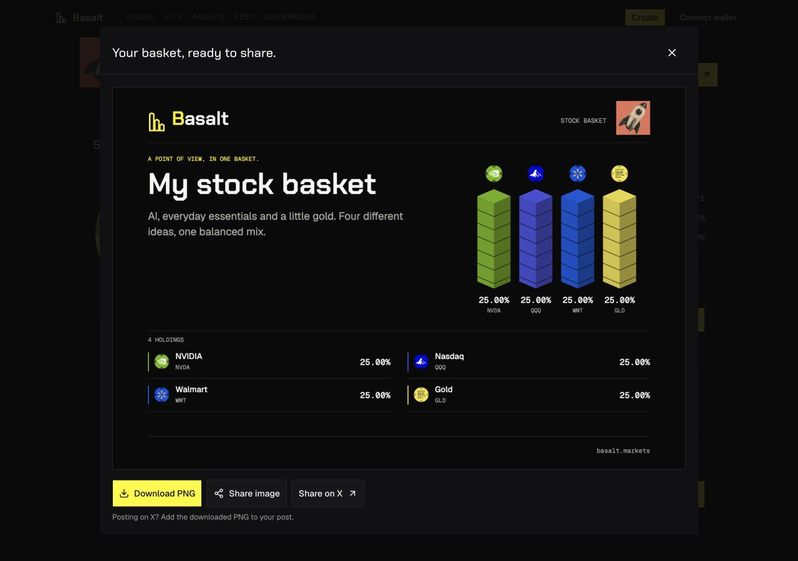
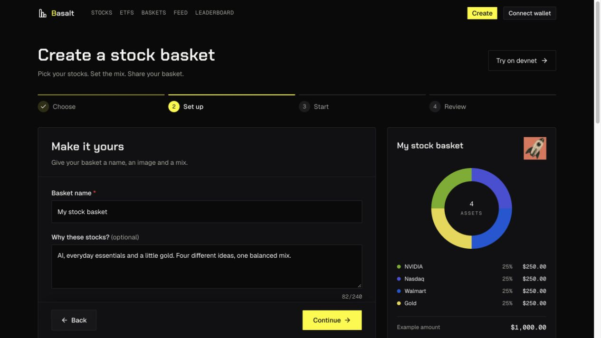
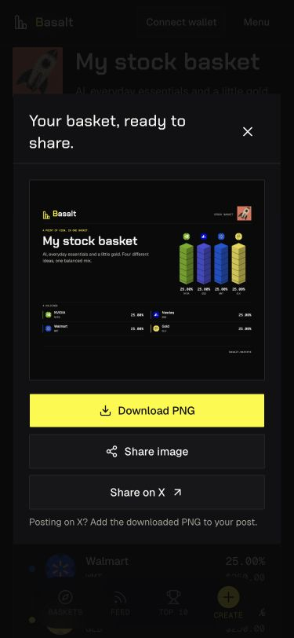

# Basket artwork frontend release, 2026-10-09

**Status: live and verified at https://basalt.markets.** GitHub source, all six CI jobs, hosted Vercel build, exact promotion and 66 public API/asset checks passed.

## Scope and preserved baseline

The owner authorized publishing the accepted stock-logo colors, basket artwork library and share-image flow to the existing https://basalt.markets Vercel project. The canonical UI checkout was based on `387ff5c`, while GitHub main had advanced to `4fd7d59eb8266472b70e7dfc460dfc1caab1e22d`. A managed release worktree was created from that newer main, and only the artwork/share/domain patch was integrated. The original dirty checkout is preserved.

The latest namespace routing, factory-availability guard, wallet intent validation, owner setup, current-balance data quality and frozen workspace dependencies must be retained. The devnet workspace merge adds the required cover to fresh draft metadata without changing old metadata bytes or transaction semantics. No backend deployment, program upgrade, authority transfer, wallet signature or financial recovery activation is part of this frontend release.

The release includes 34 cover identities, 24 new WebP artworks, 34 serverless social thumbnails, actual-logo allocation colors for all 1,271 issuer assets, portable v4 basket links, Canvas PNG preview/export, X drafts, native image-sharing capability and canonical basalt.markets metadata/links. Unrelated pitch decks, bounty drafts, videos, output folders and the separate local README rewrite are excluded.

## Verification

The earlier local UI checkout passed 93 combined Node checks, 30 devnet pipeline/draft Vitest checks and its production build. Those results do not validate the newer integration baseline by themselves. Integrated-source tests/build, exact Git source, hosted build/promotion and live browser/API evidence will be recorded below when complete.

## Existing rollback target

Before this release, `https://basalt.markets` resolved through Vercel to Ready deployment `dpl_Hh5GFqbNvwCY2SCSaNEwjsbuCGt2`, immutable URL `https://basalt-a6a0y75x5-yesildaladams-projects.vercel.app`. The previous deployment remains available for an explicit rollback promotion. Existing Vercel production configuration and custom domains will be preserved.

## Integrated release verification

The frozen canonical install completed with npm 11.6.2 and 805 packages. `npm --prefix app test` passed **272 Node tests and 57 Vitest tests**, zero failures or skips, plus the concept-preview/sample-integrity script. `NEXT_TELEMETRY_DISABLED=1 npm --prefix app run build` passed Next.js 15.5.27 compilation, lint/type validation and generation of **29 static pages**, including preserved `/devnet/setup`.

Independent merge review verified that factory readiness, exact namespace fingerprinting, wallet-intent, trade execution and confirmation paths remain the latest main baseline. Only the cover guard and cover-aware immutable metadata helper differ in fresh creation.

The initial dry upload check found an unrelated tracked pitch-deck backup among the otherwise expected upload inputs. `.vercelignore` now excludes every root pitch-deck variant and the unnecessary vendored Rust source tree. Root documentation/brand exclusions are anchored so they do not discard the public app docs route or product brand assets. Private env files, key material, caches, node_modules and build output remain excluded. The final upload report must be checked before publication.

## Published source and exact deployment

- Application source: [`fa87cffc60dd83dad8d6d3814b51f7109fb1d9a5`](https://github.com/umutyesildal/basalt/commit/fa87cffc60dd83dad8d6d3814b51f7109fb1d9a5), fast-forward pushed onto the newer main baseline.
- Vercel deployment: `dpl_HqonEZv8C7qJujVtYhCTS9SYREvi`, Ready production target; immutable URL `https://basalt-otjozkzd2-yesildaladams-projects.vercel.app`.
- Authenticated deployment metadata confirms both `sourceSha` and `gitCommitSha` exactly match the published application source. The CLI's compact inspect JSON omits metadata, so the actual read-only Vercel deployment API was used for this check.
- Hosted logs confirm npm 11.6.2 frozen canonical root installation, 809 packages and Next.js 15.5.27 production build. The production candidate's social-card endpoint produced a valid 1200 × 630 PNG before promotion, using the existing authenticated CLI because immutable candidate URLs retain Vercel protection.
- Exact deployment promoted successfully. A fresh public-domain inspect resolves `https://basalt.markets` to this deployment. Existing production settings and protection were preserved.
- [GitHub CI run 37995651908](https://github.com/umutyesildal/basalt/actions/runs/37995651908) passed all six jobs, including the full Node workspace, Rust/Clippy, backend Node 20 container, dependency audits and secret scan. The later evidence-only documentation commit does not change the deployed application source.

The final dry-upload report contained 708 files, 54,526,604 bytes, zero private/unrelated matches, all 24 new WebPs, all 34 social thumbnails and all required runtime/installer inputs. Only changed bytes needed upload. No private environment/configuration values are included in published evidence.

## Final live checks

At `2026-10-09T21:52:59.895516+00:00`, all **66 public API/asset checks passed**: social PNG generation and dimensions, four real logo requests, all 24 new WebP covers, all 34 social thumbnails, malformed-social 400, arbitrary-logo-URL 404 and the disabled production local-lab POST 404. [API proof](assets/basket-art-live-release-2026-10-09/api-checks.json), [sanitized release identity](assets/basket-art-live-release-2026-10-09/release-summary.json).

Live browser verification confirmed:

- The preview's four Bklit SVG fill values are NVIDIA `#72AE0B`, QQQ `#484FD6`, Walmart `#0D57D6` and Gold `#E8D543`.
- **Create image** produces the Canvas poster on the public domain. Stock logos, matching proportional stacks/ledger colors, selected Moon Shot cover and `basalt.markets` footer are visible. Download PNG and supported native share controls are available. The X draft and `og:image` URL use the custom public domain. No post was published.
- **Use this mix** opens the live Create setup with all four 25% allocations and the selected cover preserved. The 34-image picker and live summary render.
- At 375 × 812, the modal image and all share controls remain visible; document width is exactly 375 pixels with no horizontal overflow. Temporary viewport overrides were reset.

## Handoff

The frontend release is complete. Backend/runtime and chain state were not changed. The original dirty UI checkout and unrelated owner work remain intact; its older local HEAD must not be used as a replacement for current main. The managed `basket-art-release` worktree contains the integrated release baseline for further review. Future work should start from the current remote source and preserve namespace/readiness/owner-wallet safeguards. Earlier local-only statements in artwork documents describe their pre-publication checkpoints; this record is the current release authority.
