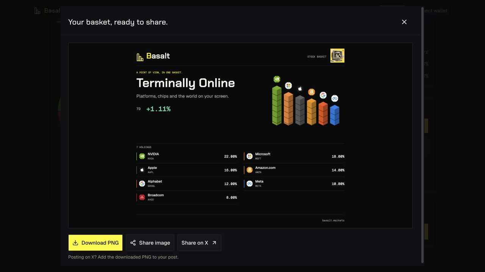
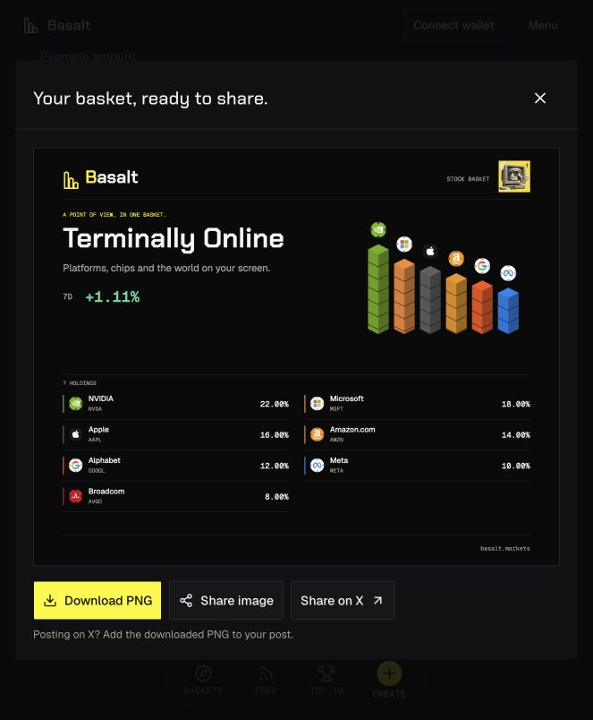

# Share poster cleanup, 2026-10-10

Status: live and verified at https://basalt.markets. Focused renderer/eligibility checks, hosted production build, exact source attestation and public browser verification passed.

The owner requested a quieter exported image. Removed the percentage and ticker labels underneath each stock stack and the `+N holdings below` line. Stock logos and proportional stack heights/colors remain; every holding’s name, ticker and percentage still appear in the full ledger. Removed the visible `Stock-close model · date` line beneath the weekly percentage. The signed `7D` figure remains.

This is a presentation-only change to the Canvas PNG. Existing exact-mix matching, finite-value and source-time eligibility guards, shared cache and image regeneration remain. Source/date provenance is retained internally and in the existing accessible description; no historical number or eligibility rule changed. The preview’s broader source explanation and compact social-link OG renderer are outside this cleanup.

The latest release baseline is `6eba591`; existing backend/devnet security, namespace/readiness and transaction code are untouched. ## Verification

- 31 focused existing image, layout and performance-eligibility checks passed, zero failures/skips. Existing Canvas assertions were adapted to the owner’s new output requirement; no additional test suite was introduced for this visual-only deletion.
- Production build passed on Next.js 15.5.27 with 29 static pages.
- Independent read-only review found no scope mistakes or regressions. The previous grid reservation/export dimensions are retained.
- The local production browser generated the actual Terminally Online PNG: unlabelled stock stacks, only `7D +1.11%` beneath the thesis, and every holding’s ticker/weight in the ledger.

## Live release

- Application source [`ee7a4455d831eb5ab35296b84f5a026aa5fc7dd3`](https://github.com/umutyesildal/basalt/commit/ee7a4455d831eb5ab35296b84f5a026aa5fc7dd3) is pushed to main.
- Ready deployment `dpl_AJvvU1od887UFEKpqdQMVyVhmYTm`, immutable URL `https://basalt-9xsvziknc-yesildaladams-projects.vercel.app`. Authoritative metadata confirms sourceSha and gitCommitSha match the application source exactly. Frozen npm 11.6.2 workspace installation and hosted Next.js 15.5.27 production build passed.
- Exact promotion succeeded. Public-domain inspect confirms basalt.markets resolves to this deployment. Previous `dpl_8E4yBspPLroWTW2mcSyFGkR1bSYS` remains the rollback target.
- Live browser regenerated Terminally Online’s actual 1600 × 1270 PNG: no text underneath the stacks, no visible source/date caption, `7D +1.11%` retained, and all seven ledger entries intact. Download filename remains `basalt-terminally-online.png`. Default viewport width and document width both 663px, no overflow. The production tab was refreshed and retained for the owner.
- [Exact-source GitHub CI](https://github.com/umutyesildal/basalt/actions/runs/37998151317) passed all six jobs, including the complete Node workspace tests/typecheck/build/hygiene, Rust/Clippy and security/dependency gates.

No backend deployment, chain action, wallet signature or social post occurred. A later evidence-only documentation commit does not change deployed application bytes. The original dirty UI checkout remains preserved; future implementation should continue from current main/the attached release worktree.
