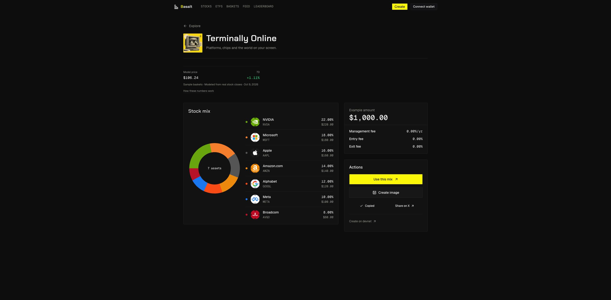
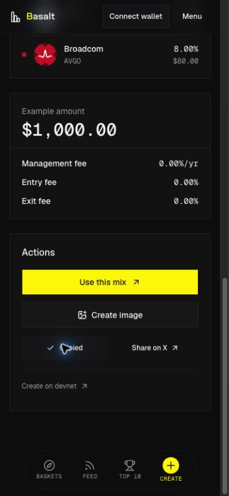
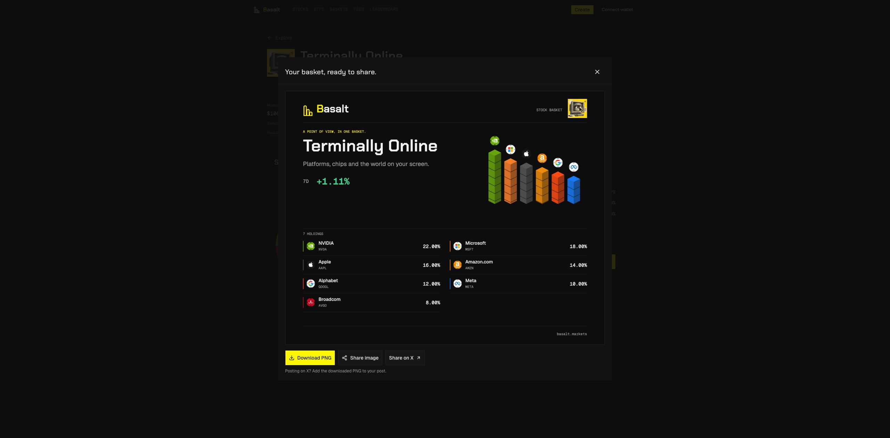

# Basket sharing and preview actions, 2026-10-10

Status: live and verified at https://basalt.markets. Backend and frontend are deployed from the same exact source; Chrome copy, real X draft, image creation and mobile checks passed.

## Owner request and result

The encoded preview URL filled an X draft with a long block of text. A shared basket now receives a short `https://basalt.markets/b/<id>` address. The existing `/preview?d=...` links remain compatible. The short page renders the same basket directly and does not redirect back to the encoded URL.

The preview has one Actions card: Use this mix, Create image, a compact Copy link / Share on X row, and a quieter Create on devnet link. The separate share/onchain cards, duplicate header CTA and full-link toggle are removed. If clipboard permission fails, the short link is selected in a manual-copy field. API failures show a retry message rather than opening a long X draft.

## Snapshot and sharing behavior

- The complete validated v4 snapshot is stored unchanged: name, thesis, cover, amount, ordered assets with optional exact mints, weights and fees. Editing a snapshot creates a different address; existing records are immutable through the API.
- The address uses the first 120 bits of SHA-256, encoded as 20 base64url characters. The complete hash and exact payload are checked for collisions. Duplicate sharing requests return the same ID.
- Storage is a separate PostgreSQL `basket_shares` table in the existing persistent VPS database. It does not write indexed baskets, financial history, positions or social posts. Opening a preview alone does not persist it. Choosing Copy link, Share on X or Create image prepares the shared snapshot.
- The public endpoint is bounded: 8 KiB body, validated v4 structure, dedicated transactions with lock/statement timeouts, 25,000-row admission cap under an advisory lock, socket-peer and global write budgets, finite limiter storage and four concurrent writes. Forwarded headers are not trusted as identities. The app resolves only the fixed configured backend origin and fails closed for malformed IDs or snapshots.
- X receives an editable draft containing the short address. No tweet is posted and PNG files are not automatically attached by the web intent. Download PNG remains available. Native file sharing is offered only when the browser supports it and the short URL is ready, then requires a user click.
- Short pages expose matching canonical, Open Graph and Twitter metadata from the same validated snapshot. Share requests are deduplicated in a bounded client cache. Async copy, X preparation and native image sharing discard results from a previous basket or a closed component.

## Verification

- App typecheck and production build passed; the build contains dynamic `/b/[id]` and the existing 29 static pages.
- Backend strict TypeScript build passed. Focused validation and actual PostgreSQL tests passed, including concurrent duplicate requests, new-connection resolution, collision preservation and concurrent near-capacity admission.
- All 1,539 backend tests passed across 66 files with actual SQL regressions enabled on a disposable PostgreSQL cluster, zero skips. The final frontend suite passed 308 Node and 57 Vitest checks plus concept-preview/sample integrity. All 28 focused short-link/resolution/metadata checks passed. Tests caught a non-string response-ID coercion gap; the explicit string guard is included in the released source. Independent read-only review found no blocking defect.
- Exact-source CI passed all six jobs. The live API, hosted metadata and real Chrome copy/X/image/responsive checks passed. [Detailed verification](assets/basket-short-links-2026-10-10/verification.md).

## Release boundary

The previous live backend reports source `ef31b239a6887715f6a2fee59fed4d079035ee76` and actual running image `sha256:83924fbc3221b7d507bbfce53a614aca802db34c7a8878c3e6c94cdf6ec15500`. Its backend/dependency/runtime files match the clean baseline used here. The only preexisting deployment-tree difference is explanatory Markdown. No unrelated runtime upgrade is needed.

Retain the previous frontend deployment `dpl_AJvvU1od887UFEKpqdQMVyVhmYTm` for rollback. Before a backend rollout, retain and restore-test a private database/source/config/image backup, then keep a fresh dump under stopped writers. Preserve private environment files and all existing volumes. This additive snapshot table does not activate historical recovery or change devnet contracts, authorities, fees, pricing, financial projections or transaction behavior.

## Verified publication

- Pushed application source [`307053da1310331c658c0401d0107f8405912199`](https://github.com/umutyesildal/basalt/commit/307053da1310331c658c0401d0107f8405912199).
- Vercel deployment `dpl_3ccnXao9qcYChJgnbistgugne2WF`, immutable URL `https://basalt-h39drtx0k-yesildaladams-projects.vercel.app`. Authoritative deployment metadata has matching sourceSha and gitCommitSha. Hosted install/build passed, then this exact deployment was promoted. Public-domain inspect resolves basalt.markets to this deployment.
- VPS backend image `sha256:8e7d0ab276307af13ad71d71da78aded59f82d3f249b93f31fd678d17c399f3a`. Runtime readiness reports the same source SHA and the backend container is healthy. Database, schema, network and required workers are ready. Historical projection remains guarded and incomplete: 104 pending collected effects, one blocked signature, four quarantined signatures, six rebuild-required baskets, zero activated recovery runs. This share-link change does not repair or activate that separate history.
- Public example: [Terminally Online](https://basalt.markets/b/3SY6THM-V28xDZqKXh_f), a 45-character complete share address. Duplicate creation and retrieval preserve the exact previous v4 snapshot. Old encoded links still render their original basket.
- Chrome’s actual clipboard and logged-in X compose UI show this short address. No tweet was posted. Image creation retains the clean stacks, source eligibility and 7D model; native sharing remains user initiated. The updated short page is left open in Chrome at the owner's request.

## Retained rollback and preparation evidence

Private VPS backups and the restore-tested isolated candidate are under `/var/backups/basalt/sharelinks_20261010_307053da`. The candidate identity matches the exact source above. Its schema application and idempotent snapshot round trip passed before live publication. A fresh stopped-writer cutover dump has SHA-256 `7773586aa7b2d126907eb2e5bc5c175b225e0c0fe91589b0bce7921722ef85a2`. Source archive `/var/tmp/basalt-short-links-source.tar` has SHA-256 `3682d7104df25f8cb3e9cebfd9fbce3e14d1a0337072e629ac64994c7652ee3e`; build context retained at `/var/tmp/basalt-release-307053da`.

An initial private rehearsal used an incorrect source-identity argument and was abandoned at `/var/backups/basalt/sharelinks_20261010_307053d`; it was never used to publish or activate anything. The first cutover preflight also rejected a Compose image-label digest before stopping writers; the actual running image was then verified against the retained image backup. The correctly bound candidate and actual container image governed the successful release. Both earlier preparation artifacts remain private for audit.

Frontend rollback promotes `dpl_AJvvU1od887UFEKpqdQMVyVhmYTm`. Backend rollback can restore the retained exact old source/config/image while leaving this additive snapshot table and new user snapshots in place. Any whole-database rollback still requires stopped writers and a separate verified restore; do not discard new live writes. No volume pruning, Caddy change, secret rotation, authority action or recovery activation occurred. A later evidence-only documentation commit does not change deployed application bytes.
