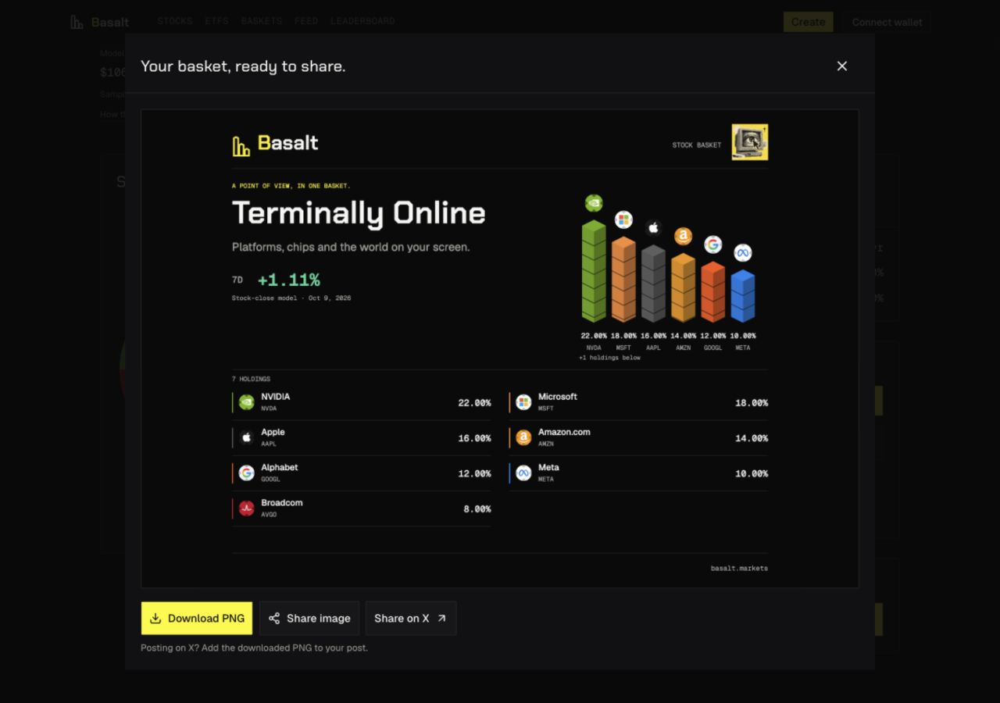
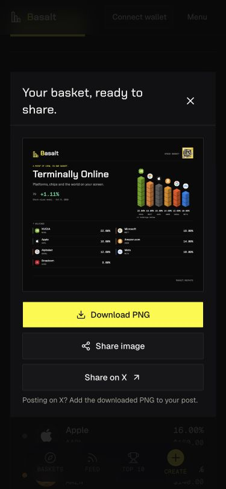
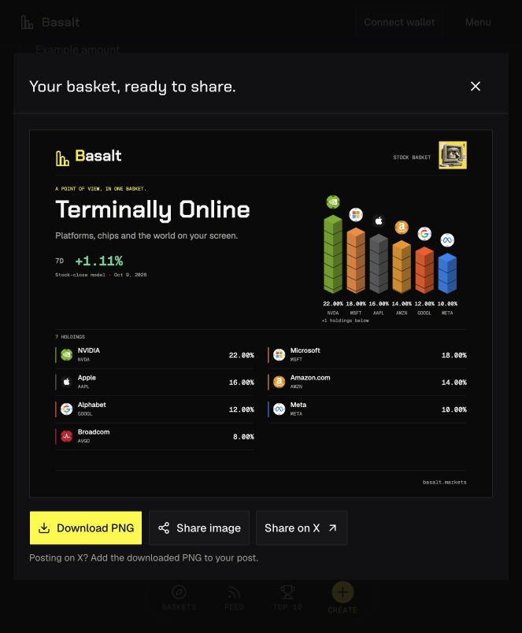

# Seven-day basket performance in shared images, 2026-10-10

Status: live and verified at https://basalt.markets. All six GitHub CI jobs, hosted build, exact source attestation, public model API and browser PNG checks passed.

## Owner request and visible behavior

Show the existing baskets’ weekly performance as `7D +4.56%`, including the downloaded sharing image. Existing curated cards already use the shared real-close model feed. Their PNG posters now include the same signed percentage, with a small `Stock-close model · Oct 9, 2026` date line. Positive, negative and zero values retain their actual sign and percentage-point scale. The original artwork, stock-logo colors, proportional stacks and full holdings ledger remain.

The image waits for an initial model request, remains exportable without a metric if the feed is unavailable, and regenerates when the selected basket’s valid weekly value/window changes. Old in-flight renders cannot replace newer results; replaced blob URLs are released. Custom mixes still export immediately without an invented history. The compact social-link OG renderer is unchanged; this request updates the downloadable PNG.

## Data and identity boundaries

The source remains the existing `/api/basket-performance` server loader, its five-minute shared cache and completed USD stock/ETF closes. These figures describe illustrative fixed-quantity buy-and-hold sample mixes, not achieved investor returns or onchain xStocks quotes. No new performance field is accepted in portable share links.

A shared exact-mix helper requires the named sample, matching unordered symbols and weights, unique holdings, and catalog-verified identity for any explicit mint. Changed names/weights/stocks, unknown mints and ticker/mint conflicts cannot borrow another model’s return. The selected item must be ready with finite positive model price, finite weekly return, aligned dates and the existing four-day completed-close/baseline tolerance. A partial response remains usable for a complete selected item.

The indexed onchain card now consumes the existing `return_7d` API field, converting its fractional ratio to percentage points exactly once and retaining valuation eligibility/finite-value guards. At the audit time all ten indexed devnet mock baskets had unavailable valuations and null returns. They correctly receive no sample-model substitute.

No backend deployment, program upgrade, authority transfer, wallet action or financial recovery activation is included. Namespace/readiness and transaction safeguards are preserved from current main `a8c260b`.

## Validation

- Full frontend checks: **290 Node tests and 57 Vitest tests passed**, zero failures/skips; concept-preview/sample-integrity script passed.
- The 18 added checks cover exact sample matching, reordered holdings, known/unknown/conflicting mints, edits, duplicate evidence, partial/unavailable data, date/staleness guards, positive/negative/zero signs, rendered PNG text/provenance and long-text clearance. Existing indexed-card quality behavior is covered.
- Next.js 15.5.27 production build passed, **29 static pages**.
- Independent read-only review found a response-wide partial-data suppression bug, corrected before validation. No remaining actionable issues in cache invalidation/cancellation, layout or indexed eligibility were identified.

The local production browser verified Terminally Online at `7D +1.11%`, using the October 2 to October 9 comparison. The image decoded as a 1600 × 1270 PNG and retained all seven holdings. At 1280 × 900 the document had no horizontal overflow, and Download PNG/native-share/X controls remained available. At 375 × 812 the document width was exactly 375 pixels and all three share actions remained reachable. Temporary viewport overrides were reset. No social post was sent.

## Published release

- Application source: [`b1f423aacb86dc21752927c392232be9187e54d5`](https://github.com/umutyesildal/basalt/commit/b1f423aacb86dc21752927c392232be9187e54d5), pushed to existing main.
- [GitHub CI run 37997434322](https://github.com/umutyesildal/basalt/actions/runs/37997434322): all six jobs passed, including the complete Node workspace, build/typecheck/hygiene, Rust tests/Clippy, dependency/security scans and backend Node 20 container.
- Ready Vercel deployment: `dpl_8E4yBspPLroWTW2mcSyFGkR1bSYS`, immutable URL `https://basalt-9jan5gwpj-yesildaladams-projects.vercel.app`. Deployment API metadata confirms both `sourceSha` and `gitCommitSha` exactly match the application source.
- Hosted installation used pinned npm 11.6.2 and the frozen canonical workspace; Next.js 15.5.27 compiled successfully. The CLI build-log connection dropped, but a separate authoritative deployment API read confirmed Ready, avoiding a duplicate upload.
- All ten candidate model items were ready before promotion. Exact promotion succeeded, and a public-domain inspect confirms basalt.markets resolves to the same deployment.
- Immediate previous deployment `dpl_HqonEZv8C7qJujVtYhCTS9SYREvi` remains available as rollback target. Existing backend, environment, project settings and deployment protection were retained.

## Final public verification

The public `/api/basket-performance` returned ten ready, finite weekly returns, comparison **October 2 to October 9, 2026**. Terminally Online was +1.11%, Chip Happens -2.51% and Offline Mode +3.39%. [Public model response](assets/basket-weekly-sharing-2026-10-10/live-performance.json).

Live browser verification produced the actual 1600 × 1270 image for Terminally Online, displaying `7D +1.11%` with the dated stock-close model line. Download filename was `basalt-terminally-online.png`. Logo colors, cover, proportional stacks and all seven holdings were intact; download/native-share/X controls were available. The default 663px viewport had no horizontal overflow. The production tab was retained for the owner; no post or wallet action was performed.

The implementation and live release are complete. A subsequent evidence-only documentation commit does not change deployed application bytes. Continue from current main/the attached release worktree; the older dirty UI checkout is preserved and must not replace the newer security baseline.
