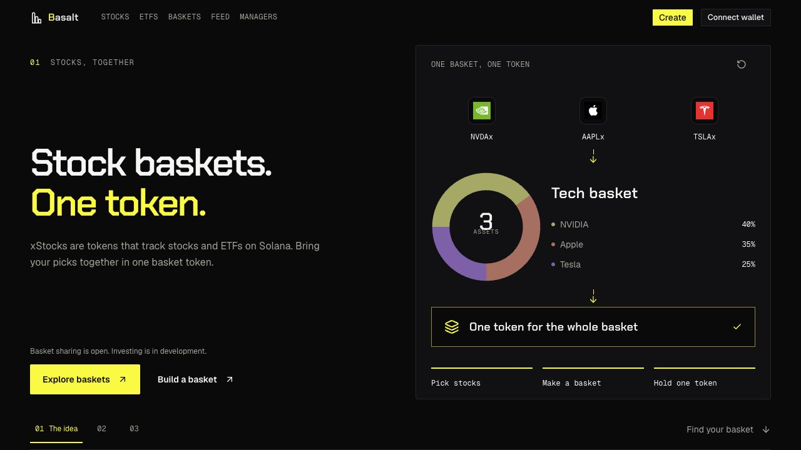

# Landing chapters — 2026-10-02

> **Superseded by the later owner feedback on 2026-10-02.** The [discovery revision](design-home-discovery-2026-10-02.md) replaces the three full-screen chapters and timed scenes with a calmer native-scroll landing. This document and its screenshots preserve the earlier iteration.

Supersedes the homepage composition and scrolling direction in `docs/design-home-desktop-2026-09-27.md`.

## Story

1. “Stock baskets. One token.” Define xStocks as tokens that track stocks and ETFs on Solana. Show three stock marks, a large composition ring, and one basket token.
2. “Choose a strategy.” Show one person's basket with a short thesis, named stock holdings, weights, fees, and working basket links. Keep the featured basket stable; animation highlights its contents rather than switching people.
3. “Build your own basket.” Explain choosing stocks, setting the mix, and sharing. Include the future V0 management-fee model in this chapter: 90% publisher / 10% protocol, paid in basket shares with holder dilution. The 3% annual cap remains unchanged in validation and protocol code. Managed V2 remains a separate localnet prototype without fees.

## Design brief

- Direction: minimal industrial, preserving Basalt's dark canvas and electric yellow.
- Density: spacious copy, compact product details, one illustration per chapter.
- Surface: one Card, flat rows, thin separators, no nested showcase cards.
- Type: large Chakra Petch headings, readable Geist body, small mono allocation labels.
- Motion: quiet highlights in three timed steps, never timed page advancement.
- Keep: real stock marks with initials fallback, one visible basket example, bottom-aligned CTAs, clear primary/secondary actions.
- Avoid: rotating sample managers, invented returns/AUM, decorative gradients, repeated disclaimers, creator jargon, and em dashes.

Reference review: Cesto's landing and Instinct's landing informed product focus and hierarchy. Their palettes, portraits, and claims were not copied. Research context is saved in the [Colosseum comparison](colosseum-comparison-2026-10-02.md); installation and the full work record are in [session updates](session-updates-2026-10-02.md).

## Layout and motion

At desktop sizes with adequate height, each section fills the viewport below the header. Left text and right Card share a common grid; copy labels sit at the top, headings and explanation below, and CTAs at the bottom. Each section has numbered navigation. The last navigation row contains xStocks and disclosure links, without a separate fourth footer stop. The only product-status sentence appears above the hero CTAs: “Basket sharing is open. Investing is in development.”

Native anchors and keyboard PageUp/PageDown/ArrowUp/ArrowDown/Home/End complement wheel chapter navigation. A wheel gesture consumes one section transition, including trackpad momentum. Animations only change the diagram's active step. They play once in three stages, pause offscreen or when the tab is hidden, and expose pause/resume/replay. Reduced motion displays the completed diagram without autoplay or smooth scrolling. Mobile/short/zoomed layouts allow natural scrolling; the mobile main area has room for the floating navigation. Forms, buttons, dialogs, and nested scroll areas retain native input behavior. Both chapter and scene-body fit are checked; a failed fit releases CSS snapping and pending navigation together.

## Product truth

The intended xStocks investment model is described as a product concept. Existing sample baskets remain concept data, and CTA links open existing concept routes. Current devnet assets are project mocks; official xStocks integration is pending. There is no real purchase, wallet signature, deployment, or fee revenue in landing illustrations. Basket manager names are sample profiles, not verified professional managers.

xStocks provide economic exposure to stocks and ETFs without shareholder rights. Definition source: [official xStocks FAQ](https://docs.xstocks.fi/docs/frequently-asked-questions). “Fund” is not used. Legal-review status remains governed by AGENTS.md and the release requirements.

## Historical verification: initial four-chapter pass — 2026-10-02

App typecheck and the 25-page production build passed. The landing was reviewed at 375×812, 768×1024, 1280×720, and 1440×900. All four desktop chapters fit their shared viewport height with no panel clipping; mobile/tablet layouts had no horizontal overflow. Wheel navigation moves down/up one chapter; native anchors and keyboard PageDown reach the next chapter. Pause/replay controls were verified, including preserving a paused diagram after scrolling offscreen. Reduced-motion behavior is implemented and source-reviewed; OS-level emulation was not used. The source files that predated this work remain preserved, with landing originals backed up in `/private/tmp/basalt-landing-before-2026-10-02`.

## Copy pass, owner feedback on 2026-10-02

Each landing chapter now has one short paragraph. Repeated concept/preview badges, illustration labels, no-purchase notices, and explanatory button footnotes were removed from the landing, create, explore, shared basket, feed, and manager profiles. Shared sample bios, strategy descriptions, and posts use shorter, natural wording. Public copy and the updated page titles use no em dashes. The create action says “Share basket”; the shared page keeps “Example amount” and a disabled onchain action labeled “Coming soon.” The copy-only edits preserved validations, fee limits, and data states. Separately, the working tree routes `/create/onchain` back to `/create`; that public-flow change predates the final three-chapter refresh and should not be described as unchanged route availability.

Copy-pass verification: app typecheck and the 25-page production build passed. The existing concept-share integrity test passed. Browser checks covered 375×812, 1280×720, and 1440×900; landing panels and the shared basket page had no horizontal overflow. All desktop chapter panels fit at 1280×720, and one wheel gesture reached the next chapter. The four-step create flow reached a valid basket URL with the updated action label. Production manager discovery, a manager profile, and feed rendering were checked. This pass was backed up separately in `/private/tmp/basalt-copy-pass-2026-10-02`.

## Final three-chapter verification — 2026-10-02

App typecheck and the 25-page production build passed after the final scroll fallback and mobile-spacing changes. `git diff --check` passed. The home component has three chapters, one product-status sentence, and no em dashes. Independent source review found no remaining must-fix after the fit fallback was centralized.

Browser checks covered 375×812, 768×1024, 1024×720, 1280×720, 1440×900, and a 1280×600 short window. There was no horizontal overflow or scene-body clipping. The three 1280×720 chapters each measure 664px beneath the header; desktop snap is active at 1024/1280/1440 with adequate height. Mobile, tablet, and the short window preserve native scroll. The final 375px view confirms disclosure links remain above the floating navigation.

One keyboard PageDown moved the final build from the first chapter to the second (scroll 1 → 665); one wheel gesture moved from the second to the third (665 → 1329), and an upward gesture returned to the second. Chapter anchors, pause/resume/replay, and the Explore/Create/featured-basket links were verified. Pause held step zero while stationary; reduced motion remains implemented and source-reviewed rather than OS-emulated. Discovery keeps the same person and composition throughout its sequence.

Screenshots are preserved in `docs/assets/landing-2026-10-02/`: `overview.jpg`, `discover.jpg`, `build.jpg`, `mobile-overview.jpg`, and `mobile-build.jpg`. Originals for this refresh are backed up in `/private/tmp/basalt-home-before-refresh-2026-10-02`. Existing unrelated working-tree changes remain preserved. This UI pass does not alter protocol code, fees, deployment state, or existing concept routes.

## Saved visual evidence

[Discovery](assets/landing-2026-10-02/discover.jpg) · [Build](assets/landing-2026-10-02/build.jpg) · [Mobile overview](assets/landing-2026-10-02/mobile-overview.jpg) · [Mobile build and footer](assets/landing-2026-10-02/mobile-build.jpg)
