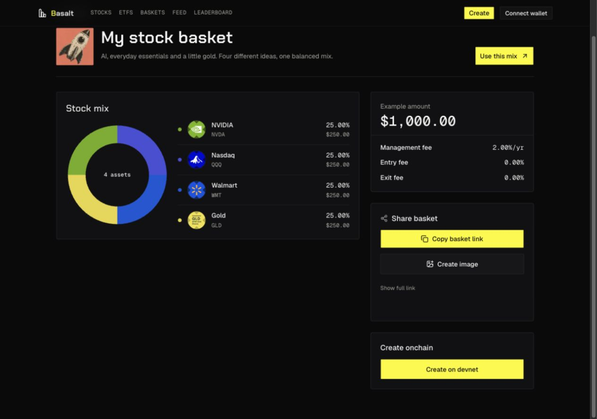
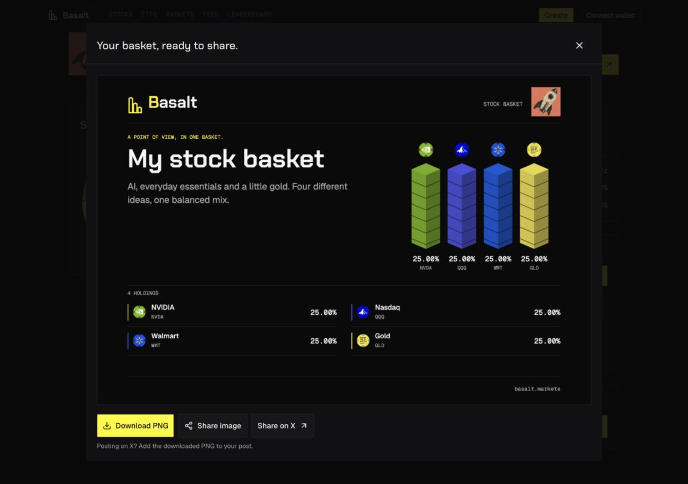
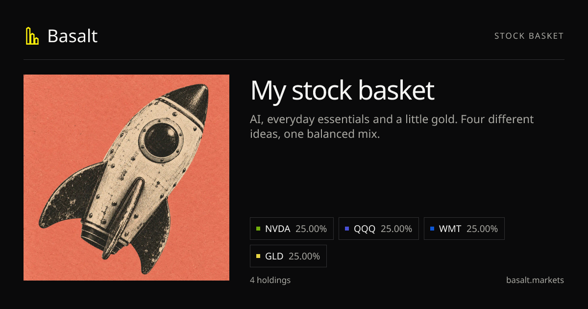

# Logo-derived basket colors, 2026-10-09

> **Release update:** This accepted implementation is now live on https://basalt.markets. [Exact published source, deployment and final live checks](basket-art-live-release-2026-10-09.md). Local-only statements below record the earlier implementation checkpoint.

**Status:** implemented, visually verified and served locally on port 3000. All 1,271 official catalog logos have extracted colors. The 35 focused color/layout/share/origin checks and the 28-page production build passed. No commit, push or deployment was performed.

## Current direction

Basket allocation colors now come from the actual stock or ETF logo used for that asset. NVIDIA reads green and Gold reads gold. This supersedes the earlier restrained ticker palette and fixed bright four-color mapping in [the initial preview record](preview-share-image-2026-10-09.md) and [the share refinement](basket-share-refinement-2026-10-09.md). Their screenshots remain historical evidence.

Keep the public domain **https://basalt.markets**, selected-cover identity, proportional isometric stacks, complete holdings ledger and percentages. The exported annual-management-fee label and duplicate footer allocation strip remain removed. Actual product fee disclosures remain. The Basalt action/focus accent is still electric yellow `#FCEE0A`.

## Extraction and provenance

`scripts/generate-asset-logo-colors.mjs` analyzes real logo bytes with the already-installed Sharp dependency. It accepts only HTTPS URLs on `xstocks-metadata.backed.fi` and `assets.parqet.com`, rejects redirects, limits responses to 2 MB and decoded images to 4 million pixels, uses eight concurrent workers and an eight-second fetch timeout. Images are resized inside 96 × 96 before analysis.

The algorithm ignores transparent pixels and weights visible pixels by alpha. When at least 1% of visible area is chromatic, neutral backgrounds and lettering are excluded. It selects the largest 50-degree hue neighborhood by visible area and averages the RGB pixels within it. This avoids a muddy full-image RGB mean. Grayscale logos retain a neutral mean. Dark colors receive only the white mix needed for at least 3:1 contrast against `#111111`; the original dominant color is preserved in provenance. There are no stock-specific overrides or arbitrary rainbow assignments.

The flat client map is `app/lib/data/asset-logo-colors.json`, keyed by exact logo URL. Detailed provenance is [manifest.json](assets/logo-palette-2026-10-09/manifest.json), schema/algorithm version 1, generated at `2026-10-09T21:39:02.414Z`. It records source URLs, SHA256 hashes, retrieval times, raw dominant colors, displayed colors, coverage and visibility adjustments. Source bytes stay in the local temporary cache for reproducibility rather than the repository.

| Source | Requested | Extracted |
| --- | ---: | ---: |
| Official issuer logos | 1,271 | 1,271 |
| Legacy Parqet logos | 41 | 39 |
| Total unique URLs | 1,312 | 1,310 |

The two unavailable legacy URLs are `CV` and `NFL`, returned as 404 by the existing legacy symbol normalization. Official CVX and NFLX issuer logos are covered. A total of 146 available logos use the neutral-image branch. Minimum final marker contrast is 3.001649:1. The lean runtime JSON is 96,644 bytes, SHA256 `2fe2e17f4f0839ec38a245a72e00d4115e029e124e2b823ab669d08374331803`.

| Asset | Raw logo mean in dominant family | Displayed allocation color |
| --- | --- | --- |
| NVIDIA | `#72AE0B` | `#72AE0B` |
| Gold | `#E8D543` | `#E8D543` |
| Nasdaq / QQQ | `#030CC6` | `#484FD6` |
| Walmart | `#014FD4` | `#0D57D6` |

Nasdaq and Walmart both have predominantly blue logos. They retain their respective blue shades instead of being forced into unrelated hues. Labels, exact percentages and stock logos continue to identify holdings. Stack side shading preserves depth; the base-color contrast threshold applies to allocation markers and top faces, not every shaded facet.

## Shared rendering and identity

`app/lib/allocation-colors.ts` resolves `getConceptAsset(symbol, mint)` and looks up that asset's current exact logo URL. Verified mint metadata takes precedence over caller-supplied ticker text. The same cached color feeds Create selection/allocation/preview, the shared-preview Bklit donut and list, Canvas stacks/ledger and social-card markers. Reordering and weight changes cannot recolor a holding. Generic market-chart series colors are unchanged.

Rendering requires no new network request or runtime pixel analysis. The existing logo-loading path still supplies the displayed images. Missing logos, unknown mints and newly changed URLs absent from the generated map use neutral `#A6A6AB`; an unknown mint cannot borrow NVIDIA branding just by claiming its ticker. Refresh the color map when refreshing catalog artwork. OG cards use the bundled catalog, while client discovery can register newer metadata, so newly changed artwork may stay neutral locally until the bundled catalog/palette is refreshed together.

Generate from the repository root with `node scripts/generate-asset-logo-colors.mjs`. Use `--offline` to reproduce cached pixels. Set `ASSET_LOGO_CACHE_DIR` to a fresh writable directory when intentionally fetching current source bytes rather than reusing the existing verified cache. The script does not modify the catalog or normalize stock identities.

## Verification and evidence

- All 1,310 final colors reproduced exactly from cached source pixels with no file changes. Five extraction invariants cover alpha weighting, neutral backgrounds, dominant hue, visibility and empty images; source script syntax and diff checks passed.
- The 35 focused Node checks passed: seven color/identity/catalog/contrast checks, 13 layout/text/stack checks, ten social-share checks and five public-origin checks. Command: `node_modules/.bin/tsx --tsconfig app/tsconfig.json --test app/lib/allocation-colors.test.ts app/lib/basket-image-layout.test.ts app/lib/basket-social-share.test.ts app/lib/site-origin.test.ts`.
- `npm --prefix app run build` passed compilation, lint/type validation and 28 static-page generation. The existing multiple-lockfile warning remains nonblocking.
- The fresh production preview showed the four exact colors in Bklit SVG fills. Creating the image produced a 1600-pixel-wide Canvas PNG preview, with matching logo colors in all four stacks and ledger markers, selected cover and `basalt.markets` footer. Download PNG, native-share and X-draft controls remained available; no post or wallet action was performed.
- The basket-specific social endpoint returned `200 image/png`, 1200 × 630, and its matching color markers were visually inspected.

## Release boundary

The final build is running locally at `http://127.0.0.1:3000`. Existing dirty work was preserved. No protocol, fee calculation, wallet transaction, public investment availability, DNS/hosting, commit, push or deployment changed in this pass.
