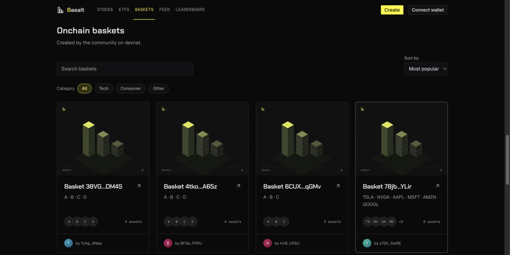

# Onchain basket gallery, 2026-10-10

> Superseded for names, descriptions, token badges and creator portraits by [the later identity refinement](onchain-basket-identities-2026-10-10.md). This record preserves the original gallery checkpoint.

Status: live at https://basalt.markets/explore; source, exact-source CI, hosted build and Chrome verification complete.

The owner requested that the lower Onchain baskets section of `/explore` use the same visual layout as the stock basket templates, with immediate artwork for baskets that have no cover.

## Product changes

- Reuse the existing stock gallery card classes, cover ratio, title/arrow, two-line description, holdings/count row and separate creator footer. Both grids now use the same one/two/four-column breakpoints and spacing.
- Add a local Basalt placeholder illustration. It is rendered underneath selected artwork immediately, stays visible during loading, and remains if a cover fails. Explicit background sizing prevents the shared cover CSS from cropping the placeholder at its native dimensions.
- Parse indexed names, descriptions and selected cover IDs defensively. Only the existing local artwork allowlist can supply images. Missing names use a short basket address; missing artwork never borrows another sample basket's identity.
- Replace the old allocation strip, large missing-value dashes and repeated devnet availability text with a compact card. Data-quality reasons remain available to assistive technology and on hover. The section identifies devnet once.
- Keep actual constituent symbols/counts and real creator addresses. Devnet holdings use neutral initial badges instead of unrelated stock issuer logos. Creator links remain separate from the basket link.
- Preserve financial eligibility, finite-value checks, return-ratio conversion and six-decimal share-price conversion. Eligible indexed prices/returns can still appear; unavailable values are not manufactured.
- Shape loading skeletons to the new cover/card layout. Search, sorting, category filters, API errors, empty states and basket destinations remain functional.

## Metadata boundary

The public list returned ten devnet baskets during inspection. All ten had `metadata_json: null`, no eligible USD valuation and no indexed 7D return. Their onchain creation commits a metadata hash; the browser-local preimage is not published as retrievable metadata by the existing flow. This visual refresh does not recover missing artwork or names from that hash and does not trust unverified localStorage. Those existing public cards correctly use the neutral placeholder and short address. Indexed valid metadata will supply the chosen cover and text when it becomes available.

No backend schema, API, signer, contract, fee accounting, price worker or onchain transaction changes are part of this update.

## Validation

- Five focused metadata tests cover valid JSON/object input, all allowlisted covers, malformed/oversized metadata, arbitrary artwork URLs, control/bidi characters, Unicode bounds and literal HTML.
- App checks passed: 323 Node tests, 57 Vitest tests and concept-preview integrity checks; typecheck and production build passed.
- Chrome checks at 375, 768 and 1,280 CSS pixels: matching one/two/four columns, no horizontal overflow, ten immediate placeholder backgrounds, no nested links and no broken onchain image elements. Tested address search, unmatched-search state, Tech category, sorting and the correct basket-detail destination. Restored the viewport and closed the local test tab.
- Existing local-development warnings in the unchanged basket detail concern Base UI button semantics; existing sample artwork has a Next 16 image-quality configuration notice. No new onchain-card runtime error was observed.
- An independent agent reviewed metadata trust, cover failure/loading behavior, financial gating and link semantics without actionable findings. The visual pass caught and corrected the placeholder background-size reset.

## Publication

- Application source: `9e847a8b0014c5e402c2c8592a0e3280bbed5023`, pushed to public `origin/main`.
- All six exact-source CI jobs passed: https://github.com/umutyesildal/basalt/actions/runs/38044594010 . Node workspace includes the app tests, typecheck and build; Rust, backend-container, secret-scan and both dependency gates passed.
- Vercel deployment: `dpl_2YCPYFKdZh8e7ZETYMTKJKnkMTyQ`; immutable URL https://basalt-67gwr9pl2-yesildaladams-projects.vercel.app . The hosted build completed and deployment metadata confirmed `READY` with matching `sourceSha` and `gitCommitSha`.
- Chrome verified the candidate's ten cover-first cards, ten placeholder backgrounds, no horizontal overflow, no missing-value dashes and no console errors. After CI completed, this exact deployment was promoted. Inspecting https://basalt.markets resolved to the same ID.
- Live Chrome verification at https://basalt.markets/explore confirmed ten redesigned cards and ten placeholders. The public website screenshot is saved below. The live result remains open in Chrome; candidate and local test tabs were closed, and viewport overrides reset.
- Frontend rollback deployment: `dpl_DQxGPWM5wjzCN4uujDVUdvTwjdr7`. The VPS remains at `307053da1310331c658c0401d0107f8405912199`; no backend rollout or chain transaction occurred.
- Later documentation-only commits do not change the deployed application bytes. Preserve the older dirty UI/pitch checkout.

