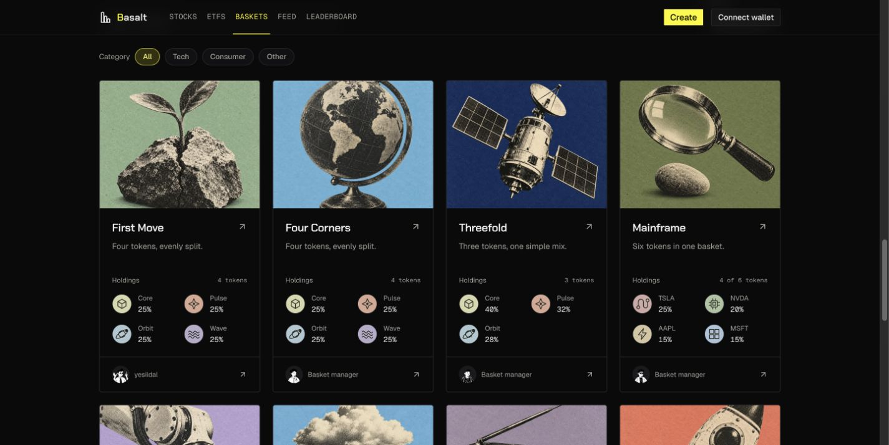

# Onchain basket identities, 2026-10-10

Status: live at https://basalt.markets/explore. Source pushed, all six exact-source CI jobs passed, hosted build verified and Chrome live checks complete.

This supersedes the neutral address/placeholder direction in [the earlier gallery pass](onchain-basket-gallery-2026-10-10.md). The owner explicitly requested more inviting basket names, short descriptions, varied artwork, token illustrations and Notionists-style creator portraits.

## Design and behavior

- Existing metadata still wins. Missing devnet identities use stable, decorative titles such as First Move, Four Corners and Threefold, paired with different allowlisted Basalt collage covers. They stay consistent across discovery, basket detail and the wallet workspace. Search understands the displayed names.
- Descriptions stay short and describe only known composition. Equal splits are called equal only when every positive target weight is valid and the sum is exactly 10,000 bps. No investment thesis, owner identity, return or real asset backing is invented.
- The four exact project-issued BSTEST mints use illustrated display aliases Core, Pulse, Orbit and Wave. Tooltips preserve their actual mint and test-token identity. Other devnet stock-symbol fixtures keep their ticker and receive original local pictograms. The detailed holdings view retains raw units and copyable mint addresses.
- Cards show the four largest actual weights in a compact two-column ledger. Larger baskets read, for example, “4 of 6 tokens.” No equal-weight values are fabricated when weights are absent. The detail donut and token illustrations share the same muted palette.
- Public creator names and uploaded avatars are honored. Missing or failed avatars use one of 24 local line portraits, consistently selected from the wallet. Nameless creators read “Basket manager”; the actual creator link is preserved. Profiles marked private are excluded. Optional profile requests never block the gallery, preserve completed results when other requests time out, and cannot update an unmounted effect.
- Cover placeholders remain underneath artwork during loading/failure. Unknown metadata URLs cannot choose cover artwork. Separate basket and creator links, metric eligibility and missing-value guards remain intact.

These are presentation changes only. Immutable metadata commitments, token mints, target weights, fees, transaction builders, wallet signing, backend state and financial eligibility are unchanged. Current legacy devnet creation restrictions remain in force.

## Artwork provenance

Token pictograms are original local SVGs under `app/public/images/devnet-tokens`. Basket covers reuse the existing licensed project library.

Creator fallbacks are static SVGs fetched from the official [DiceBear Notionists](https://www.dicebear.com/styles/notionists/) v9 API, using generic seeds `basalt-portrait-0` through `basalt-portrait-23` and background `1a1a1c`. The style is by Zoish and published under CC0 1.0. [HTTP API documentation](https://www.dicebear.com/how-to-use/http-api/). No wallet address is sent to DiceBear at runtime. All 24 SVGs were parsed and checked for script/foreignObject content before inclusion; runtime requests use local assets.

## Validation

- App suite: 331 Node tests, 57 Vitest tests and concept-preview integrity checks passed. Typecheck passed.
- Fifteen focused basket-display checks cover stable fixture identities, valid metadata priority, non-devnet behavior, safe text/art bounds and truthful allocation descriptions. Four additional token/avatar checks cover exact-mint aliasing, devnet boundaries, fixture ticker preservation and local asset existence.
- Chrome verified the desktop gallery, displayed-name search and matching detail header/artwork/composition. At 375, 768 and 1,280 CSS pixels there was no horizontal overflow; the temporary viewport override was reset.
- Existing Base UI development warnings in unchanged link/button semantics remain in basket detail. They are independent of artwork and display identity.
- Production build passed. Independent final source review found no release blocker; profile privacy, alias boundaries, exact mint/weight mapping and all 35 SVGs were checked.

## Publication

- Application source `091f42a50ccc92c1038190ba2155b2b6eca7d0aa` pushed to public `origin/main`.
- All six exact-source CI jobs succeeded: [release CI](https://github.com/umutyesildal/basalt/actions/runs/38045923068). Node workspace, dependency audit, backend container, Rust reachability, Rust workspace and secret scan passed.
- Vercel hosted build completed. Deployment `dpl_9uNcxGVkAruWuyCjnLYKG7aFyhqQ` is `READY` and its `sourceSha` and `gitCommitSha` match the application source. Immutable URL: https://basalt-ovmtsq9mi-yesildaladams-projects.vercel.app .
- Chrome verified ten named/artwork cards, complete visible token and avatar images, no horizontal overflow and the real public name “yesildal” on the hosted candidate. This exact deployment was promoted after CI passed; inspecting https://basalt.markets resolved to the same deployment ID.
- Live Chrome checks confirmed all ten titles and no broken loaded card images. The result remains open in Chrome; audit/candidate tabs were closed and the temporary viewport override was reset. [Sanitized release evidence](assets/onchain-identities-2026-10-10/release-checks.json).
- Frontend rollback deployment: `dpl_2YCPYFKdZh8e7ZETYMTKJKnkMTyQ`. The VPS remains at `307053da1310331c658c0401d0107f8405912199`; no backend rollout, chain transaction or authority action occurred.
- Later documentation-only commits do not alter deployed application bytes. The older dirty UI/pitch checkout is preserved; only this refinement's documentation and public screenshot evidence are mirrored there.

