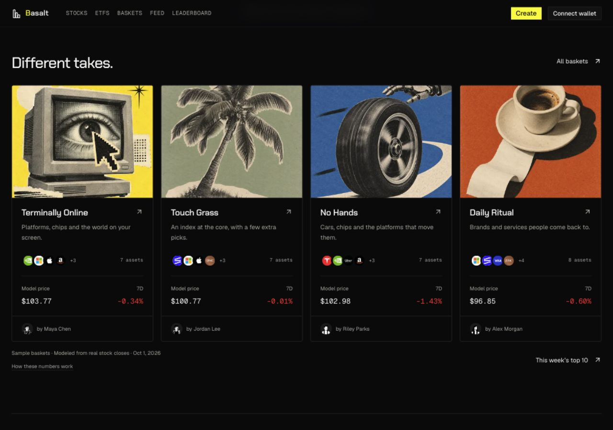

# Basket performance and public product audit, 2026-10-02

## Result and scope

The public discovery flow now connects visual basket cards, a ten-basket leaderboard, sample people, basket detail and wallet-free creation. Every sample basket has a historical model price and seven-calendar-day change computed from real underlying market closes. The owner explicitly approved this model approach after being told that these examples have no investor trading history.

This pass also fixes indexed return integrity, UI unit conversion, malformed copy links, mobile creation controls and keyboard step navigation. It is a product and data-path audit of the current local prototype, not a new security attestation or production deployment.

Canonical checkout: `/Users/umutyesildal/orca/workspaces/createyouretf/createyouretf`. Preserve the existing uncommitted governance, wallet, package, video and earlier design work. No commit, push or public deployment was performed.

## Product decisions

- Preserve the calm hero, four original featured baskets, artwork, native scrolling and visual management-fee section.
- Cards add only **Model price** and **7D**. No new chart, dense dashboard, invented AUM or investor profit claim.
- `/explore` has ten curated baskets. The first four IDs, allocations and share links remain compatible.
- `/leaderboard` defaults to the ten sample baskets ranked by 7D model return, highest first. Negative returns remain visible. The ranking universe is these ten samples, not all stocks or all deployed baskets.
- People remain in the adjacent tab and at `/leaderboard?tab=people`. Desktop navigation says **Leaderboard**; the mobile pill says **Top 10**.
- Shared visual cards and metrics also appear in Feed and sample profiles. Recognized sample mixes retain metrics on `/preview`. Custom baskets do not inherit unrelated performance.
- One source/date note and a collapsed methodology explain the numbers on each surface. Do not restore repetitive no-purchase or preview warnings.
- Copy stays short, human and free of em dashes. Management fees remain conditional on future investing availability.

## Model methodology

Each model starts at a $100 reference unit on the first common close on or just after September 1, 2026. Initial units are `100 × weightBps / 10000 / baseClose`. Those units remain fixed; weights drift with prices. This is a buy-and-hold historical price model, not periodic rebalancing.

The price at a date is the sum of each fixed quantity multiplied by that day's completed USD close. Seven-day return is `(latestModel / baselineModel - 1) × 100`; the baseline is the last common close at or before seven calendar days before the latest common close. Every ranked model uses the same end and baseline dates.

Source: Yahoo Finance daily `quote.close` observations, split-adjusted price closes. Dividends, fees, trading costs and slippage are excluded. Underlying stock and ETF prices are not xStocks execution quotes, vault NAV or achieved investor returns. [Yahoo historical-data help](https://help.yahoo.com/kb/SLN2311.html) and [adjusted-close explanation](https://in.help.yahoo.com/kb/adjusted-close-sln28256.html) describe the source distinction.

The parser excludes unfinished regular sessions and waits five minutes after the declared session end. Missing constituents, invalid weights, non-USD inputs, invalid closes or more than four calendar days of staleness fail closed. There are no synthetic price fallbacks. Incomplete models are excluded from ranking and show unavailable card values, never 0%.

The same-origin `/api/basket-performance` uses a fixed Yahoo host with redirect rejection, bounded concurrency of four, per-request timeout, a total fetch deadline, request deduplication and a five-minute successful cache. Partial/unavailable responses cache for 30 seconds. The shared client store uses one request and refresh timer across cards, refreshes on visibility restoration, and offers retry on unavailable data.

## Captured real-data evidence

The source probe fetched 23 symbols in 1.43 seconds with maximum concurrency four. All ten models were ready, each with 22 common closes. Concurrent requests shared the result; the cached probe generated zero additional upstream requests. This is one local probe, not a production latency SLA.

- Source probe: `2026-10-02T13:54:07.075Z`.
- Built API probe: `2026-10-02T13:55:17.482Z`.
- Base: `2026-09-01`, reference value `$100`.
- Comparison: `2026-09-24` to `2026-10-01`.
- The open October 2 session was excluded.
- Full records: [source/cache evidence](assets/performance-2026-10-02/market-evidence.json), [built API response](assets/performance-2026-10-02/api-response.json).

These numbers are a dated observation and will change as new completed closes arrive.

| Rank | Sample basket | Model price | 7D |
|---|---|---|---|
| 1 | Power Hungry | $102.12 | +0.64% |
| 2 | Chip Happens | $111.66 | +0.23% |
| 3 | Touch Grass | $100.77 | -0.01% |
| 4 | Terminally Online | $103.77 | -0.34% |
| 5 | Daily Ritual | $96.85 | -0.60% |
| 6 | No Hands | $102.98 | -1.43% |
| 7 | Offline Mode | $94.82 | -2.46% |
| 8 | Main Character | $104.19 | -2.58% |
| 9 | Payday | $98.24 | -2.78% |
| 10 | After Hours | $100.24 | -4.03% |

## Audit findings and fixes

| Finding | Change | Why it matters |
|---|---|---|
| Basket performance used growth in total NAV | Indexed list, performance and basket leaderboard use share-price changes with dated baselines | Deposits no longer appear as investment gains |
| List omitted 7D and could mix refreshed rankings with another timestamp | Select current snapshot values and time together; expose 7D | Values and freshness describe the same observation |
| Missing or stale history could imply a valid ranking | Null returns and exclusion from ranked data | Young or stale baskets do not acquire fabricated results |
| Fractional API returns displayed as percentages without conversion | Convert ratios to percent exactly once | A 4% result displays 4%, not 0.04% |
| API share price is per raw unit | Multiply by 1,000,000 for the human six-decimal share display | Price labels and values use compatible units |
| Benchmark sort and card used different windows | Shared window choice for both | The visible comparison explains the ordering |
| Trade history and feed divided value by share decimals twice | Multiply raw shares by raw-unit share price; convert only whole-share display price | Corrects trade reference value by a factor of one million |
| Legacy leaderboard labeled total NAV as NAV per share | Use Total value and null-safe return formatting | Removes a misleading unit label and null crash |
| Short mixes produced +0 or negative hidden-asset counts | Render the extra count only above four holdings | Three-asset and four-asset examples remain clean |
| Shared detail lost discovery metrics | Match curated name and exact stock allocation before attaching model metrics | The card-to-detail journey remains consistent |
| Sample creator detail used older text-only cards | Use the shared visual basket card | Artwork and metrics persist through the person journey |
| Create footer overflowed at 320px | Flexible equal-width mobile actions | Both Back and Share remain usable |
| Invalid copy silently started a default basket | Explicit recovery with fresh-start and Explore actions | Users know their source mix was not loaded |
| Step changes left keyboard focus behind | Focus the new heading and expose aria-current=step | Step transitions are usable with keyboard and assistive technology |
| Client refresh could skip a five-minute tick | Schedule after completion and refresh on visibility change | A returning tab does not retain an expired cached quote |

## Product scorecard

Scores are qualitative judgments for the current local prototype, not benchmark measurements. Target user: someone exploring stock strategies or sharing their own mix. The first meaningful action is opening a basket, then copying and sharing a mix without connecting a wallet.

| Dimension | Score /10 | Evidence and next improvement |
|---|---:|---|
| Onboarding | 8 | Clear two-action hero and wallet-free copy flow; validate comprehension with new users |
| Core experience | 7 | Explore, rank, inspect, copy and share connect; public investing is still unavailable |
| Error handling | 8 | Missing prices fail closed and invalid share/copy links recover; provider outage UI deserves ongoing monitoring |
| Information architecture | 8 | One clear leaderboard entry, People in a related tab, cards connect to detail; distinguish future live universe when it exists |
| Visual design | 8 | Shared covers, typography, two quiet metrics and restrained rows; six new samples reuse four original cover themes |
| Performance | 7 | One cached market batch and shared client request; sample profile still carries a large real-profile bundle |
| Accessibility | 7 | Table headers, signed values, focus states and corrected wizard focus; full screen-reader and zoom audit remains open |
| Feature completeness | 5 | Idea creation and historical discovery work; investment, official xStocks and fee revenue remain release work |
| Overall | 7.25 | Coherent discovery prototype with material production work still open |

The strongest parts are the visual identity, consistent basket-to-person navigation and truthful model performance. The next highest-impact work is dependable production market data, validating the flow with first-time users, and the already documented investing release gates.

## Validation

- Final app production build and TypeScript passed; 25 static pages plus the dynamic market endpoint. First-load JavaScript: Home 203 kB, Explore 145 kB, Leaderboard 139 kB. Existing multi-lockfile and optional native bigint warnings remain non-blocking. [Build log](assets/performance-2026-10-02/app-build.log).
- Model and shared client tests: **20 passed**, covering fixed quantities, calendar-day windows, negative returns, common dates, missing/stale inputs, incomplete sessions, request deduplication, retry timing, tab visibility and cleanup. [Test log](assets/performance-2026-10-02/model-tests.log).
- Preview/share/sample-integrity checks passed for all ten baskets. The test command requires the app alias config: `TSX_TSCONFIG_PATH=app/tsconfig.json node --import tsx app/tests/concept-preview.test.ts`.
- Backend: **672 tests across 25 files**, including **18 actual PostgreSQL cases** and **27 return unit tests**. Backend TypeScript build passed. The disposable PostgreSQL instance was stopped and cleaned up. See [indexed return integrity and schema upgrade](indexed-basket-return-integrity.md).
- Rust workspace: **214 tests passed**. No program logic changed; existing Anchor cfg warnings remain.
- Browser: validated 320, 375, 768 and 1280px layouts across public discovery, cards, leaderboard and creation. No horizontal overflow in the measured views. Checked ten-row descending ranking, negative values, preserved four-card home, sample profile links, matching detail values, methodology disclosure, copy/edit/share, invalid copy recovery, flexible mobile actions and focused step headings. [Recorded checks](assets/performance-2026-10-02/browser-checks.json).
- Final leaderboard browser console capture contained no warnings or errors. Provider-down rendering was source-reviewed; fail-closed data and retries are regression-tested. Full screen-reader/zoom and cross-browser certification remain open.
- `git diff --check` passed. Final build is served locally at `http://127.0.0.1:3000`; backend changes are verified source changes, not a newly deployed service.

[Desktop leaderboard](assets/performance-2026-10-02/leaderboard-desktop.jpg) · [Mobile leaderboard](assets/performance-2026-10-02/leaderboard-mobile.jpg)

The database upgrade is documented separately and does not need to run for the sample-model endpoint. Do not treat local PostgreSQL test evidence as a production migration.

## Remaining roadmap

Quick wins: measure first-visit comprehension, audit high-zoom/screen-reader behavior, and split the sample profile from the heavier real-profile imports. Do not add more explanation to the hero without evidence that users need it.

Medium effort: move historical quotes to a supported production data contract, persist close snapshots, define provider monitoring and review redistribution rights before launch. Current Yahoo access is a dependency with no availability SLA in this prototype.

Major work: official xStocks support, verified release governance, live investing flows, realized creator-fee accounting and independent protocol/security review. Existing localnet/devnet evidence is not replaced by this UI audit. See the existing implementation backlog and V2 status documents.

## Implementation map

- Model calculations/tests: `app/lib/basket-performance.ts`, `app/lib/basket-performance.test.ts`.
- Source/API: `app/lib/server/basket-performance.ts`, `app/app/api/basket-performance/route.ts`.
- Shared client and display: `app/lib/use-basket-performance.ts` and its regression test, `app/components/basket/basket-performance.tsx`, `basket-story-card.tsx`.
- Surfaces: HomeExperience, concept gallery, leaderboard, Feed, sample creator profile and preview.
- Integrity: backend list/performance/social queries, derived rankings schema/migration and regression tests.
- Create: route copy validation and the concept wizard.
