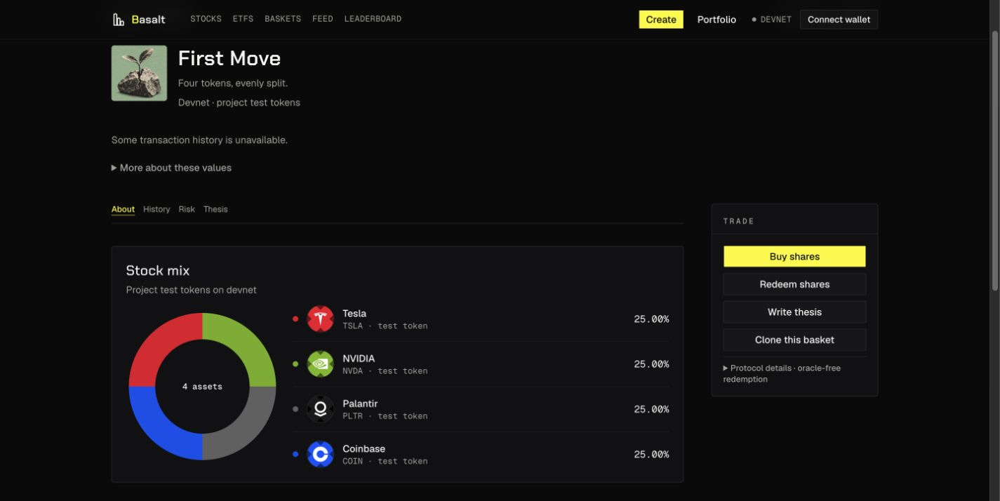

# Shared stock mix presentation, 2026-10-10

Status: pushed to GitHub and live at https://basalt.markets. All six exact-source CI jobs, hosted build and Chrome live verification passed.

The owner prefers the stock logos, logo-derived colors and boxed allocation card from concept previews over the prior Core/Pulse/Orbit/Wave presentation. This supersedes only the token artwork, aliases and composition layout in [the earlier identity pass](onchain-basket-identities-2026-10-10.md). Stable basket names, varied covers, creator portraits and actual metadata priority remain.

## Result

- Preview and onchain About now render the same `StockMixCard`, using the existing Card primitives and Bklit PieChart. It has a 220px donut, compact asset ledger, circular logos, matching color dots and aligned percentages. Mobile stacks the chart above the rows.
- The four exact project-issued BSTEST mint addresses have stock-themed decoration: Tesla, NVIDIA, Palantir and Coinbase. They reuse the same catalog logos and logo-derived colors as preview. Rows say `TSLA · test token`, for example; the card identifies project test tokens on devnet. Tooltips retain the underlying BSTEST identity, actual mint and absence of issuer backing. These decorative themes are not official xStocks, equity holdings, prices or new mint identities.
- Other recognized devnet stock-symbol mocks keep their ticker and short test-token identity. Unknown A/B/C/D fixtures cannot be mistaken for a real ticker. Mainnet resolution uses the exact supplied mint; a ticker cannot give an unknown mint issuer artwork or financial eligibility. Missing or failed artwork has a local neutral fallback.
- Actual target weights remain unchanged. A complete donut requires positive safe-integer weights with an exact 10,000-bps sum. Partial or invalid weights never become a fabricated normalized chart. No illustrative USD amount is passed for devnet holdings. Preview retains its explicitly illustrative allocation dollars.
- `/create/onchain` now opens Create directly, even without a name query. `/devnet` remains trade-first. The short subtitle follows the selected mode. This is a navigation fix; creation availability, retired-treasury rejection, transaction builders, wallet signatures and namespace checks remain unchanged.
- Link-rendered buttons now declare their native semantics correctly, removing the existing Base UI button warnings. Trade tooltips describe underlying tokens without asserting that mocks are xStocks.

No core program, raw/scaled accounting, fee math, redeem path, backend state or onchain authority was changed.

## Verification

- 333 Node tests and 57 Vitest tests passed; concept-preview integrity checks and app typecheck passed.
- Six token/avatar regression checks include exact four-mint devnet themes, parity with preview colors/logos, preserved mock ticker identity, unknown-mainnet-mint boundaries and local fallback existence.
- Production Next.js build passed with the existing production API and devnet environment.
- Chrome verified preview and onchain cards, actual differing example weights, no mock dollar values and direct Create selection. At 375, 768 and 1,280 CSS pixels there was no horizontal overflow; the viewport override was reset.
- Independent source review found no new blocker. Immutable metadata, financial eligibility, namespace and retired-treasury guards are preserved.

## Devnet follow-up

Read the [current onboarding audit](devnet-onboarding-audit-2026-10-10.md) and [official xStocks availability research](xstocks-devnet-availability-2026-10-10.md). New creation is still disabled because the separate owner namespace is only partially deployed. The owner explicitly selected `TcAgGWYnr5uVQGRiU67C1ynpH5JDKCmwWaCA6V2ANea` as its immutable treasury recipient in this conversation. This decision is not an owner signature or completed authority handoff. The source preparation policy remains pending until the reviewed operational sequence can truthfully be completed.

The shortest intended public flow is Connect wallet → Get test tokens if needed → Name and mix → Create basket. Actual first-use rent and any extra lookup-table approval must be accounted for. Official public issuer devnet assets were not found; current mocks remain appropriate for the public test flow.

## Publication

- Application source `b145e324062f6a82d612959a06ee27f4a214a983` pushed to public `origin/main`.
- [Exact-source CI](https://github.com/umutyesildal/basalt/actions/runs/38047179406): all six jobs succeeded, including Node workspace, dependency audit, backend container, Rust reachability, Rust workspace and secret scan.
- Vercel deployment `dpl_HRjf3RYgJqmmjbby9c91jJRdYgwp` is READY. Both deployment metadata hashes match the source commit. Immutable candidate: https://basalt-4gppeubhn-yesildaladams-projects.vercel.app .
- Chrome candidate checks verified all four loaded stock logos, matching colors, exact 25% weights, no invented mock dollars and Create selected on direct navigation. Existing Base UI button warnings are absent; the separate existing Phantom wallet-adapter registration warning remains.
- Direct Create encountered a transient public-devnet RPC 429. One explicit Retry connection cleared the displayed connection error; the creation-unavailable guard remained visible. This is not a completed wallet/create proof. Provider resilience and account-rent estimation remain onboarding work in the linked audit.
- This exact deployment was promoted after all six CI jobs passed. Inspecting https://basalt.markets resolved to the same ID and source hashes. Live Chrome verified the shared card and visible mock identity; the result remains open. Candidate/local tabs were closed. [Sanitized release evidence](assets/stock-mix-2026-10-10/release-checks.json).
- Backend remains at `307053da1310331c658c0401d0107f8405912199`. Previous frontend deployment `dpl_9uNcxGVkAruWuyCjnLYKG7aFyhqQ` is retained as rollback. No chain transaction, deployment, authority transfer or creation activation occurred in this UI release.
- Later documentation-only commits do not change deployed application bytes. The older dirty UI/pitch checkout is preserved; only this revision's MD files and public evidence are mirrored there.

